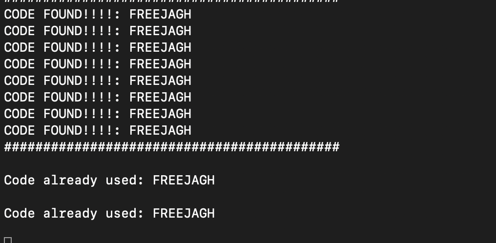

# infinite-food-glitch

bot that gets codes from [chipotle's free burrito promotion](https://chipotle.com/FreePointer) and (optionally) paste's them into imessage

## features

- automatic pasting into imessage
- image recognition

## requirements

- latest version of python
- twitter account sign in
- (optional) macos accessibility & imessage
- tesseract-ocr

## installing tesseract for macos

```
brew install tesseract
```

### installing package requirements

```
pip install -r requirements.txt
```

## usage

### clone / download repository

```
git clone https://github.com/baolong281/infinite-food-glitch.git
cd infinite-food-glitch
```

### running with image scanning and no pasting

```
python3 bot.py --nopaste true --image true
```

by default the bot runs with pasting and without image scanning

## after running

1. have messages open on the side with a conversation open to 888222
2. when prompted to configure your cursor click on where the message box is (make sure not to move this window)
   
3. when prompted sign into twitter. this is required to be able to view tweets from the chipotle account. if you get an error message you probably mistyped your login info
4. start the bot and leave your computer on, when chipotle tweets a code it will automomatically paste it and send the message, or it will copy it to your clipboard and show up in the terminal

   

## exiting

```
ctrl + c
```

## 🚨 reminder 🚨

bot may not always work as the code formatting is changed day by day
